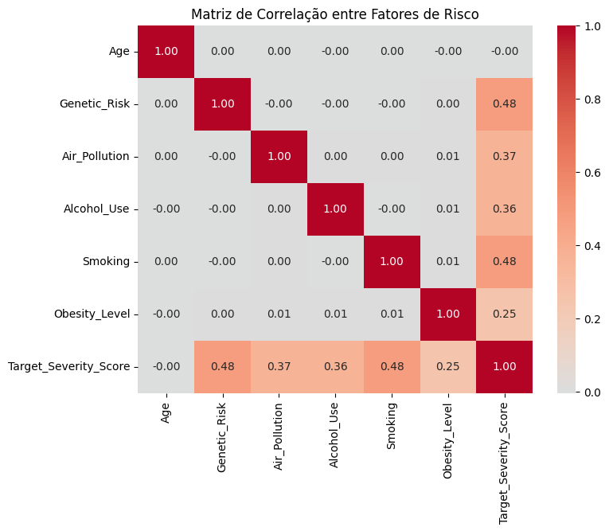
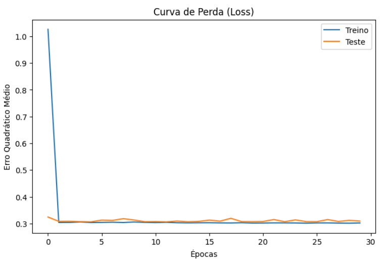
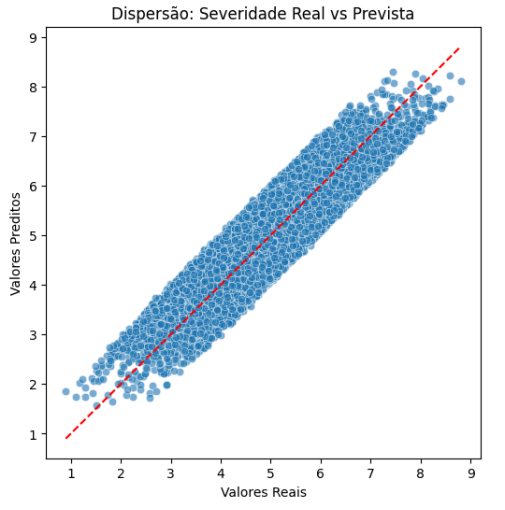
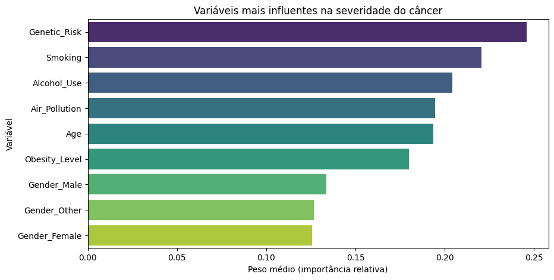
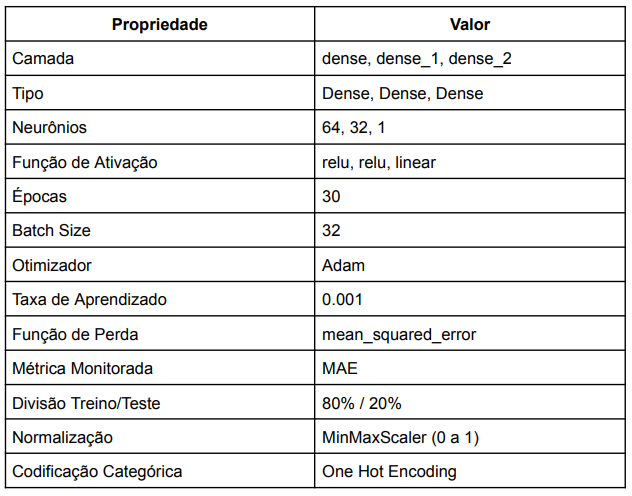

# Predição da Severidade do Câncer com Rede Neural (MLP) — 2015 a 2024

Projeto de **Data Science / Machine Learning** com foco em **identificar padrões** e compreender **fatores mais associados à severidade do câncer**, avaliando o impacto de características demográficas, genéticas, comportamentais e ambientais.

> **Trabalho em grupo (Faculdade Impacta Tecnologia)**  
> Integrantes: Lucas Rodrigues Ferreira; Marcelo Ponciano; Matheus Souza Santiago; Pedro Henrique Rosa Sales; Rhyan Morais de Azevedo; Sandro de Lima Oliveira.

---

## Objetivo

Construir um modelo preditivo para estimar a variável-alvo **Target_Severity_Score** (severidade em escala contínua) e, a partir da análise do modelo e do EDA, extrair **insights sobre fatores de risco** potencialmente associados ao aumento da severidade.

Perguntas que guiariam a análise:
- Quais variáveis se relacionam mais com o score de severidade?
- O modelo consegue prever a severidade com erro baixo e boa generalização?
- Quais limitações e cuidados são necessários ao interpretar resultados?

---

## Base de dados

Dataset do Kaggle: **Global Cancer Patients (2015–2024)**  
Link: https://www.kaggle.com/datasets/zahidmughal2343/global-cancer-patients-2015-2024

> Observação importante: esta base é descrita como **simulada/sintética** pelo autor (útil para estudos, EDA e modelagem), então os resultados devem ser interpretados como exercício acadêmico e não como evidência clínica.

---

## Variáveis usadas no modelo

### Features numéricas
- `Age`
- `Genetic_Risk`
- `Air_Pollution`
- `Alcohol_Use`
- `Smoking`
- `Obesity_Level`

### Feature categórica
- `Gender` (codificada com **One-Hot Encoding**)

### Variável alvo (regressão)
- `Target_Severity_Score`

Também foram avaliadas/consideradas outras colunas no dataset, mas algumas foram removidas no projeto por potencial de viés/efeito indireto ou por não serem “fatores de risco” (ex.: custo de tratamento, sobrevida, região/país, tipo de câncer), para reduzir ruído e evitar relações artificiais.

---

## Pré-processamento

- **One-Hot Encoding** para `Gender`
- **MinMaxScaler (0 a 1)** para features numéricas
- Split **80% treino / 20% teste** (`random_state=42`)

---

## Modelagem

### Tipo de problema
- **Regressão** (previsão de um score contínuo)

### Modelo
- Rede Neural **MLP (Perceptron Multicamadas)** com TensorFlow/Keras:
  - Dense(64, ReLU)
  - Dense(32, ReLU)
  - Dense(1, Linear)

### Hiperparâmetros principais
- Otimizador: **Adam**
- Learning rate: **0.001**
- Loss: **Mean Squared Error (MSE)**
- Métrica monitorada: **MAE**
- Épocas: **30**
- Batch size: **32**

---

## Resultados

Métricas reportadas no projeto:

### Treino
- MAE: **0.4715**
- MSE: **0.2986**
- RMSE: **0.5464**
- R²: **0.7932**

### Teste
- MAE: **0.4815**
- MSE: **0.3079**
- RMSE: **0.5549**
- R²: **0.7833**

Interpretação rápida:
- As métricas de treino e teste ficaram **próximas**, sugerindo boa generalização dentro do recorte e split utilizados.
- A curva de loss se estabiliza e o gráfico Real vs Previsto tende a alinhar na diagonal, indicando coerência entre predições e valores observados.

> **Importante:** como a base é sintética/simulada, esses resultados não devem ser interpretados como performance “clínica”. O valor aqui é demonstrar pipeline de DS/ML + análise e comunicação.

---

## Visualizações (recomendado)

- Matriz de correlação: `images/correlation_matrix.png`
- Curva de perda (treino vs teste): `images/loss_curve.png`
- Dispersão (real vs previsto): `images/scatter_real_vs_pred.png`
- Importância de variáveis: `images/feature_importance.png`
- Arquitetura + hiperparâmetros (tabela): `images/model_hyperparams_table.png`

---

## Importância das variáveis (como foi feito)

A “importância” foi estimada a partir dos **pesos médios absolutos** da primeira camada (abordagem simples para ter um sinal inicial de influência das features no modelo).

> Limitação: isso não substitui métodos mais robustos de explicabilidade (ex.: Permutation Importance, SHAP). Pretendemos evoluir essa análise em versões futuras.

---

## Créditos
- Dataset: Zahid Feroze (Kaggle) - Global Cancer Patients (2015-2024).
- Projeto acadêmico em grupo - Faculdade Impacta Tecnologia.

## Licença
- Licenciado sob CC BY-NC-SA 4.0 (https://creativecommons.org/licenses/by-nc-sa/4.0/)

